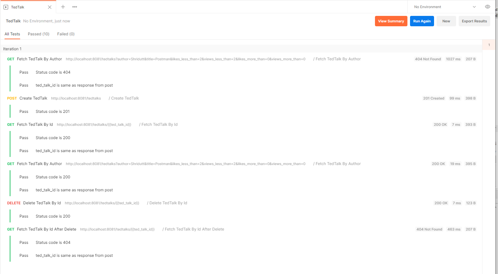

# TedTalksApp
CRUD (Create/Read/Update/Delete) functionality for TedTalks

##Project Description

This is a Multi-Maven module Project it uses SpringBoot Framework version 2.3.6.RELEASE.
The Project uses Spring Batch to Read csv files as a data sources and load,  and insert it into an in memory db so that we can serve the data as a REST API

Everytime we start the APP, it re-loads the data from csv and prn files form app resources (ted-talks-dao/resources/) and it can be fetched from our API

## Prerequisites: 
To build and run this project below are the prerequisites
	
	|-Apache Maven Version: 3.*
	|-Java 1.8 (JDK, JRE)
	
## Development Environemt Used:

	Spring Boot version: 2.3.6.RELEASE	
	Java 8
	Junit 5
	Lombok
	H2 DB
	
## Project Structure:
	ted-talks-parent
		|-ted-talks-dao
			-src/main/java 			## java code for dao
			-src/main/resource		## resources like (application.properties, .csv files)
			-src/test/java			## unit test java code 
			-src/test/resource		## unit test resources like (application.properties, .csv files)
		|-ted-talks-rest-api 
			-src/main/java 			## java code for rest api
			-src/main/resource		## resources like (application.properties)
			-src/test/java			## unit test java code 
			-src/test/resource		## unit test resources like (application.properties)
			-src/int-test			## postman integration tests
		|-screenshots				## some useful screenshots of project
			
## Building the project:

The packaging of the parent maven module (ted-talks-parent) is POM, so if we want to run test cases from all modules and build all modules together, we can do it with command:
	
	mvn install
It will generate artifacts for all sub modules in their respective target directories

The packaging of the sub maven module (ted-talks-dao) is JAR, so if we want to run test cases and build the Jar, we can do it with command:
	
	mvn install
It will generate artifact Jar file for this sub modules in target directory, Which can be used as a library dependency in other spring app	
	
The packaging of the sub maven module (ted-talks-rest-api) is JAR, so if we want to run test cases and build the Jar, we can do it with command:
	
	mvn install
It will generate artifact Jar file for this sub modules in target directory, Which can be used to deploy the REST api on any machine with JRE installed.	
 
## ted-talks-dao Module

- The ted-talks-dao module contains the code which reads the data from files and loads it into the in memory database.
- This module does not have any SpringBoot Application class, and so it can not be started as a stand alone app.
- This module can be used as a library in a Spring Boot app for getting data from DAO

## ted-talks-rest-api Module

- The ted-talks-rest-api module contains the code which uses ted-talks-dao module internally to fetch ted talks data and serve it as a REST API
- This module have a SpringBoot Application class, and so it can be started as a stand alone REST app.

## Running the project:
Once the ted-talks-rest-api module is built using maven command, a Jar artifact will be generated in ted-talks-rest-api/taget/ directory.

To start the REST API, we can run below command inside ted-talks-rest-api/taget/ directory
	
	java -jar ted-talks-rest-api-1.0.jar

## Testing

- Unit test cases are implemented to shocase the concept of unit testing in Springboot using mockito and mock mvc.
- Unit test cases are available under below directory structure 

	|-ted-talks-dao
			-src/test/java			## unit test java code 
	|-ted-talks-rest-api 
			-src/test/java			## unit test java code 
	
- Postman collection is available to test the APIs under below directory structure 

	|-ted-talks-rest-api 
			-src/int-test			## postman integration tests

## Running the tests:

	mvn test
	
## Running the REST API To Visualize the data in browser:

Below URls can be called with a client e.g. cURL, postman once the app is up and running (to run the app see Running the project section):

	HTTP POST: http://localhost:8081/tedtalks
	Example Request Body:
	{
		"title": "Ted Talk Added From Postman using REST API",
		"author": "Shridutt Kothari",
		"date": "June 2022",
		"views": 1,
		"likes": 1,
		"link": "https://ted.com/talks/ozawa_bineshi_albert_climate_action_needs_new_frontline_leadership"
    }
	
	HTTP GET: http://localhost:8081/tedtalks/{ted_talk_id}
	Example Response Body:
	{
		"id": 5444,
		"title": "Ted Talk Added From Postman using REST API",
		"author": "Shridutt Kothari",
		"date": "June 2022",
		"views": 1,
		"likes": 1,
		"link": "https://ted.com/talks/ozawa_bineshi_albert_climate_action_needs_new_frontline_leadership"
    }
	
	HTTP GET: http://localhost:8081/tedtalks?author=Shridutt&title=Postman&likes_less_than=2&views_less_than=2&likes_more_than=0&views_more_than=0
	Example Response Body:
	[{
		"id": 5444,
		"title": "Ted Talk Added From Postman using REST API",
		"author": "Shridutt Kothari",
		"date": "June 2022",
		"views": 1,
		"likes": 1,
		"link": "https://ted.com/talks/ozawa_bineshi_albert_climate_action_needs_new_frontline_leadership"
    }]
	
	HTTP PATCH: http://localhost:8081/tedtalks/{ted_talk_id}
	Example Request Body:
	{
		"title": "Ted Talk Added From Postman using REST API",
		"author": "Shridutt Kothari",
		"date": "June 2022",
		"views": 1,
		"likes": 1,
		"link": "https://ted.com/talks/ozawa_bineshi_albert_climate_action_needs_new_frontline_leadership"
    }
	
	HTTP DELETE: http://localhost:8081/tedtalks/{ted_talk_id}
	
	
## Screenshots:

Screenshots of API output are available under screenshots directory of this repository

## Desclaimer:

- Completed Project is implemented solely by:

	Shridutt Kothari 
	shriduttkothari@gmail.com
	+91-9713740276

- Implementation is done as per developer's understanding from the given Instructions and restrictions.

## Multiple Tradeoffs are made while implementation of this project like:
	
-  JUnit test cases are not implemented for all classes and methods
-  Postman test cases are not implemented to cover all functional scenarios
-  Enough Exception handling is not implemented due to time constraints
-  In Memory DB is used
-  Only 4 REST end-points are exposed
-  No validation on Data is perforemd before loading from data sources like csv
-  No duplication is checked on Data before loading it from data sources like csv
-  PATCH endpoint is not workign currently and Need to be fixed, issue is with runing update query on H2 DB, its throwing incompatible data type exception

